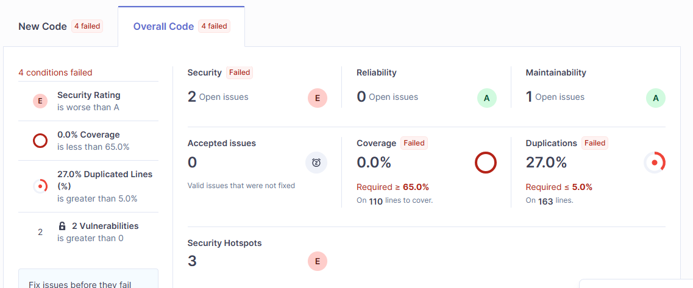
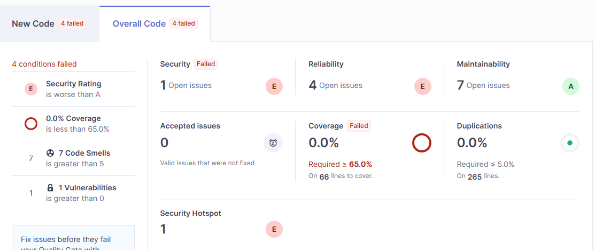

# Đánh giá và So sánh Coverity vs SonarQube

## 1. Tổng quan

| Các tiêu chí | Coverity | SonarQube |
|-----------|---------------------|------------------------|
| Loại công cụ | SAST (Static Application Security Testing) | SAST + Code Quality |
| Giấy phép | Commercial (trả phí) | Community (free) + Enterprise (trả phí) |
| Tập trung chính | Security defects, critical bugs (buffer overflow, null deref, race conditions) | Code quality ( bao gồm code smells, duplication, complexity) + security cơ bản |
| Quản lý kiểm thử | Không hỗ trợ  | Có hệ thống test management đầy đủ |
| Tỉ lệ False Positive | Rất thấp (~15-20%) nhờ cách phân tích chuyên sâu | Trung bình (~25-40%) do scan theo pattern |
| Phương pháp phân tích | Phân tích xuyên suốt và chuyên sâu qua nhiều function, phân tích toàn bộ program | Pattern matching, taint analysis, symbolic execution (nhẹ hơn), chủ yếu phân tích trong nội bộ 1 function |
| Độ cover của rule phân tích | Có sẵn các rule built-in, cover rất rộng các tiêu chuẩn security | Có sẵn các rule set về code smells, code quality. Các rule về security cần plugin bổ trợ hoặc custom thêm rule set  | 
| Cộng đồng | Phụ thuộc vào support từ vendor | Cộng đồng lớn và active, tài liệu đầy đủ, nhiều plugin |
| Các ngôn ngữ hỗ trợ | Hỗ trợ hầu hết các ngôn ngữ lập trình phổ biến hiện nay, mạnh nhất là C/C++ và Java | Hỗ trợ hầu hết các ngôn ngữ lập trình phổ biến hiện nay |
| Khả năng tích hợp CICD | Hỗ trợ hầu hết các platform CICD phổ biến hiện nay | Hỗ trợ hầu hết các platform CICD phổ biến hiện nay  |


## 2. Phân tích ưu nhược điểm

### Coverity - Điểm mạnh
1. **Deep Analysis Engine**: Khả năng phân tích xuyên suốt theo luồng dữ liệu, có thể trace bug qua nhiều file, nhiều function call. Phát hiện được các lỗi phức tạp như:
   - Buffer overflow qua nhiều layer abstraction
   - Race conditions trong code đa luồng
   - Resource leaks trong complex control flow

2. **Low False Positive**: Coverity nổi tiếng với tỷ lệ false positive thấp

3. **Incremental Analysis**: Có khả năng chỉ phân tích code mới thay đổi, giảm thời gian scan đáng kể trong CI/CD


### Coverity - Điểm yếu
1. Cần chi phí license 
2. Thời gian full scan lâu (hàng giờ cho project lớn)
3. Cần infrastructure mạnh để chạy
4. Không có tính năng code quality (duplication, complexity metrics)

### SonarQube - Điểm mạnh
1. **All-in-one Code Quality**: Kết hợp security scanning + code quality + technical debt tracking
2. **Quality Gate**: Cho phép thiết lập threshold tự động block merge nếu code không đạt chuẩn
3. **Community Edition miễn phí**
5. **Hotspot Review**: Phân loại security issues cần manual review vs confirmed vulnerabilities
6. **Quản lý kiểm thử**: Hỗ trợ quản lý các test case song song với phân tích code

### SonarQube - Điểm yếu
1. Phân tích security không sâu bằng Coverity (chủ yếu scan theo pattern)
2. Không phát hiện được nhiều loại bug phức tạp (race conditions, các vấn đề phức tạp về memory)
3. False positive rate cao hơn khi cần quét security
4. Bản community có giới hạn về khả năng phân tích 

## 3. Thử nghiệm với code thực tế

Thông tin lab:
- Coverity Analysis version 2025.9.0
- SonarQube Enterprise Edition v2026.2.1 

## 3.1 Thử nghiệm tổng quan

Sử dụng script sau bao gồm 5 vấn đề và cho vào pipeline để quét lần lượt bằng Coverity và SonarQube.


<details>
  <summary>vul_test.py</summary>

```python
import os
import subprocess
import sqlite3
import pickle
import hashlib

# ============================================================
# 1. INSECURE DESERIALIZATION
# ============================================================
def receive_data_from_network(socket_data: bytes) -> bytes:
    """Simulates receiving untrusted data"""
    return socket_data


def process_session(raw_data: bytes) -> dict:
    """
    Vulnerable: Untrusted data flows through function chain to pickle.loads
    Coverity traces: raw_data -> receive_data_from_network -> pickle.loads (RCE)
    """
    session_bytes = receive_data_from_network(raw_data)
    return pickle.loads(session_bytes)


# ============================================================
# 2. COMMAND INJECTION VIA INDIRECT FLOW
# ============================================================
def get_target_host(user_request: dict) -> str:
    """Extracts hostname from user request"""
    return user_request.get("host", "localhost")


def build_command(host: str) -> str:
    """Builds diagnostic command"""
    return f"ping -c 4 {host}"


def run_diagnostic(user_request: dict) -> str:
    """
    Vulnerable: Command injection via multi-step taint flow
    Coverity traces: user_request -> get_target_host -> build_command -> subprocess
    """
    host = get_target_host(user_request)
    cmd = build_command(host)
    result = subprocess.run(cmd, shell=True, capture_output=True, text=True)
    return result.stdout

# ============================================================
# 3. CODE QUALITY ISSUES
# ============================================================
def calculate_risk_score(user):
    """SonarQube flags: high complexity, code smell"""
    # BAD: Cyclomatic complexity too high, duplicated conditions
    score = 0
    if user.age > 60:
        score += 10
    if user.age > 60 and user.income < 30000:
        score += 20
    if user.age > 60 and user.income < 30000 and user.region == "rural":
        score += 15
    if user.credit_score < 500:
        score += 30
    if user.credit_score < 500 and user.debt > 50000:
        score += 25
    if user.credit_score < 500 and user.debt > 50000 and user.employment == "none":
        score += 35
    if user.history == "bad":
        score += 20
    if user.history == "bad" and user.bankruptcies > 0:
        score += 40
    if user.history == "bad" and user.bankruptcies > 0 and user.age < 30:
        score += 10
    if user.age > 60 and user.credit_score < 500:
        score += 50
    if user.age > 60 and user.credit_score < 500 and user.debt > 50000:
        score += 45
    if user.age > 60 and user.credit_score < 500 and user.debt > 50000 and user.history == "bad":
        score += 60
    if user.region == "urban" and user.income > 100000:
        score -= 10
    if user.region == "urban" and user.income > 100000 and user.credit_score > 700:
        score -= 20
    if user.region == "urban" and user.income > 100000 and user.credit_score > 700 and user.history == "good":
        score -= 30
    return score

# DUPLICATE CODE - SonarQube detects
def validate_email_v1(email):
    if "@" not in email:
        return False
    parts = email.split("@")
    if len(parts) != 2:
        return False
    if "." not in parts[1]:
        return False
    if len(email) > 254:
        return False
    if len(parts[0]) == 0:
        return False
    if parts[1].startswith("."):
        return False
    if parts[1].endswith("."):
        return False
    if ".." in parts[1]:
        return False
    if " " in email:
        return False
    if len(parts[0]) > 64:
        return False
    return True


def validate_email_v2(email):  # Near-duplicate of v1
    if "@" not in email:
        return False
    parts = email.split("@")
    if len(parts) != 2:
        return False
    if "." not in parts[1]:
        return False
    if len(email) > 254:
        return False
    if len(parts[0]) == 0:
        return False
    if parts[1].startswith("."):
        return False
    if parts[1].endswith("."):
        return False
    if ".." in parts[1]:
        return False
    if " " in email:
        return False
    if len(parts[0]) > 64:
        return False
    return True

# ============================================================
# 4. WEAK CRYPTOGRAPHY
# ============================================================
def hash_password(password: str) -> str:
    """Vulnerable: Weak hashing algorithm"""
    # BAD: MD5 is cryptographically broken
    return hashlib.md5(password.encode()).hexdigest()


def verify_integrity(data: bytes) -> str:
    """Vulnerable: SHA1 for security purposes"""
    # BAD: SHA1 is deprecated for security use
    return hashlib.sha1(data).hexdigest()

# ============================================================
# 5. HARDCODED CREDENTIALS
# ============================================================
class DatabaseConfig:
    """Vulnerable: Hardcoded credentials"""
    # BAD: Credentials in source code
    DB_HOST = "192.168.1.100"
    DB_USER = "admin"
    DB_PASSWORD = "SuperSecret123!"  # SonarQube flags this immediately
    API_KEY = "sk-proj-abc123xyz789"  # Hardcoded API key

    def connect(self):
        conn_string = f"postgresql://{self.DB_USER}:{self.DB_PASSWORD}@{self.DB_HOST}/production"
        return conn_string
```
</details>
<br>

**Kết quả**

**Coverity:**

- 2 high severity: liên quan tới command injection và nhận diện nguồn dữ liệu không tin cậy như `receive_data_from_network(raw_data)`
- 3 low severity: liên quan tới các giá trị hardcode

**SonaQube:**



- 2 security issue báo cáo về password và API_KEY đang hardcode
- 3 security hotspot báo cáo về sử dụng mã hóa yếu và hardcode IP
- 27% duplication được phát hiện

| Case | Vulnerability Type | Coverity | SonarQube | Detail |
|---|-------------------|----------|-----------|---------|
| 1 | Insecure deserialization | ✅ | ❌ | Coverity mặc định nhận diện các luồng dữ liệu đều không đáng tin cậy, trừ khi chúng đã được chứng minh là an toàn. Ở đây `session_bytes` được load từ nguồn chưa được validate là `receive_data_from_network`, vì vậy Coverity đánh fail. SonarQube có khả năng nhận diện nguồn dữ liệu không tin cậy như HTTP request, file input,... tuy nhiên trong case này dữ liệu truyền qua từ `receive_data_from_network`, Sonar không thể trace tiếp và chứng minh nguồn dữ liệu là không an toàn, do vậy không nhận diện đây là rủi ro |
| 2 | Command injection via indirect flow | ✅ | ❌ | Coverity có khả năng phân tích sâu và liên function, tìm ra rủi ro khi command được truyền vào hệ thống. Sonarqube có vẻ khả năng track qua nhiều function kém hơn, như trong ví dụ `ping -c 4` được truyền qua `user_request => get_target_host() => build_command() => subprocess.run()`|
| 3 | Code complexity/smells | ❌ | ✅ | SonarQube phát hiện ra tỉ lệ trùng lặp 27% (ngưỡng % chấp nhận có thể được set trong Quality gate) |
| 4 | Weak cryptography (MD5/SHA1) | ⚠️ | ✅ | SonarQube phát hiện ra 3 security hotspot, trong đó có 2 chỗ sử dụng MD5 và SHA1 là những loại mã hóa cũ không còn an toàn sử dụng và khuyến nghị sử dụng SHA-256, SHA-512. Một vấn đề nữa cũng được tìm thấy là IP được hardcode có thể dẫn tới CVE-2006-5901, CVE-2005-3725 |
| 5 | Hardcoded credentials | ⚠️ | ✅ | SonarQube có thế mạnh ở pattern matching, phát hiện ra 2 security issues về password và API_KEY bị hardcode. Coverity vẫn có thể detect nhưng không phải focus chính |


> ✅ = Phát hiện tốt | ⚠️ = Phát hiện hạn chế | ❌ = Không phát hiện

## 3.2 Thử nghiệm sâu hơn với một issue cụ thể: SQL Injection

> Source code nằm trong folder `vul_python/`

### Lần 1: SQL Injection trực tiếp trong 1 file (Single-file, direct taint)

**Mô phỏng:** Tình huống cơ giản nhất — developer viết code SQL injection trong cùng 1 function, source (request.args) và query (cursor.execute) nằm cạnh nhau, không qua bất kỳ lớp trung gian nào. Đây là pattern mà mọi SAST tool đều phải phát hiện được.

<details>
  <summary>vul_test.py</summary>

```python
import sqlite3
from flask import Flask, request

app = Flask(__name__)


@app.route("/search")
def search_endpoint():
    username = request.args.get("username")
    conn = sqlite3.connect("app.db")
    query = f"SELECT * FROM users WHERE username = '{username}'"
    cursor = conn.cursor()
    cursor.execute(query)
    result = cursor.fetchall()
    conn.close()
    return str(result)
```
</details>
<br>

> **Kết quả: Cả 2 đều detect ra ✅**

---

### Lần 2: SQL Injection tách source và query sang 2 file (Cross-file, 1 hop)

**Mô phỏng:** Tình huống thực tế hơn — developer tách code thành helper functions ở file riêng. Source (lấy input từ HTTP request) nằm ở `helpers.py`, query SQL cũng ở `helpers.py`, nhưng logic ghép query vẫn nằm ở file chính. Tool cần trace taint qua 1 lớp function call giữa 2 file để phát hiện.

<details>
  <summary>vul_test.py</summary>

```python
import sqlite3
from flask import Flask, request
from helpers import get_request_param, db_query
app = Flask(__name__)


@app.route("/search")
def search_endpoint():
    username = get_request_param("username")
    return str(db_query(f"SELECT * FROM users WHERE username = '{username}'"))
```
</details>

<details>
  <summary>helpers.py</summary>

```python
"""Helper utilities - separating taint source from sink across files"""
import sqlite3
from flask import request

def get_request_param(param_name: str) -> str:
    """Get parameter from HTTP request"""
    return request.args.get(param_name)

def db_query(query: str) -> list:
    """Execute a database query"""
    conn = sqlite3.connect("app.db")
    cursor = conn.cursor()
    cursor.execute(query)
    result = cursor.fetchall()
    conn.close()
    return result
```
</details>
<br>

> **Kết quả: Cả 2 đều detect ra ✅**

---

### Lần 3: SQL Injection qua 3 file + data transformation (Cross-file, 2+ hops, indirect query)

**Mô phỏng:** Tình huống phức tạp hơn, mô phỏng kiến trúc thực tế dạng layered — user input đi qua 3 file: `vul_test.py` (controller) → `helpers.py` (utility layer) → `executor.py` (data access layer). Dữ liệu bị biến đổi format giữa các layer: từ string → dict → lặp qua dict để build SQL. Tool cần trace taint qua 2+ hops và qua luồng thay đổi của cấu trúc data mới phát hiện được.

<details>
  <summary>vul_test.py</summary>

```python
import sqlite3
from flask import Flask, request
from helpers import get_request_param, db_query
from executor import fetch_records
app = Flask(__name__)


@app.route("/search")
def search_endpoint():
    username = get_request_param("username")
    return str(fetch_records("users", {"username": username}))
```
</details>

<details>
  <summary>helpers.py</summary>

```python
from flask import request


def get_request_param(param_name: str) -> str:
    """Get parameter from HTTP request"""
    return request.args.get(param_name)
```
</details>

<details>
  <summary>executor.py</summary>

```python
import sqlite3


def fetch_records(table: str, filters: dict) -> list:
    """Fetch records from database with filters"""
    conn = sqlite3.connect("app.db")
    cursor = conn.cursor()
    conditions = " AND ".join([f"{k} = '{v}'" for k, v in filters.items()])
    stmt = f"SELECT * FROM {table} WHERE {conditions}"
    cursor.execute(stmt)
    result = cursor.fetchall()
    conn.close()
    return result
```
</details>
<br>

> **Kết quả: Cả 2 tool đều KHÔNG phát hiện ra ❌**

Cả Coverity lẫn SonarQube đều mất dấu taint khi dữ liệu bị lặp biến đổi format khi đi qua các layer. Qua 3 kết quả cho thấy đối với Python, Coverity không quá vượt trội hơn so với SonarQube.

---

### Lần 4: Chuyển qua Java — SQL Injection qua 4 file + fake sanitizer (Cross-file, 3 hops, string transformation)

> Source code nằm trong folder `vul_java/`

**Mô phỏng:** Trong mô phỏng này có 3 vấn đề được đưa vào:

1. Mô phỏng Java codebase theo nhiều layer: Controller → Service → Helper → Repository. Đặc biệt có thêm 1 hàm "giả sanitize" (`stripComments`) chỉ remove SQL comments nhưng không ngăn injection, tool cần phát hiện ra rằng `replaceAll` không làm mất taint. Đây là test giới hạn tối đa khả năng phân tích xuyên suốt qua nhiều class/file kết hợp string transformation.

```
UserController.java     @RequestParam String id          ← SOURCE (user input)
        ↓
UserService.java        findUser(id)
        ↓               QueryHelper.buildCondition("id", userId)
        ↓
QueryHelper.java        stripComments(value)             ← fake sanitize (replaceAll giữ taint)
                        return field + " = '" + cleaned + "'"
        ↓
UserRepository.java     "SELECT * FROM " + table + " WHERE " + condition
                        stmt.executeQuery(sql)           ← SINK (SQL injection)
```

2. Mô phỏng về Path Traversal, cũng là 1 vul nổi tiếng tương tự SQL injection

```
UserController.java     @RequestParam String name        ← SOURCE (user input)
        ↓
UserService.java        generateReport(name, token)
                        FileUtil.readFile("/opt/reports/" + name + ".pdf")
        ↓
FileUtil.java           new FileInputStream(path)        ← SINK (path traversal)
```

3. Ngoài ra, cài cắm thêm 2 chỗ chứa connection chưa được close đầy đủ, chỉ close ở happy case, mô phỏng Resource Leak

```
UserRepository.java =>  conn.close(); // only close on non-error case
FileUtil.java       =>  reader.close();  // only closes on happy case
```

**Kết quả:**
- **Coverity**: Phát hiện 14 issues (5 HIGH + 1 MEDIUM + 9 LOW), bao gồm SQL Injection, Path Traversal và Resource Leak ✅
- **SonarQube**: 



- 1 security issue: về vấn đề password bị hardcode tại dòng `conn = DriverManager.getConnection(DB_URL, "root", "pass");`. Điều này đúng như mong đợi, SonarQube quét pattern tốt. ✅
- 4 reliability issue: SonarQube quét 4 resource chưa được close. Tìm được rủi ro về Resource Leak dựa trên pattern ✅
  - UserRepository.java — Connection không close
  - UserRepository.java — Statement không close
  - FileUtil.java — FileInputStream không close
  - FileUtil.java — BufferedReader không close
- 1 security hotspot: Flag biến `sql` trong `ResultSet rs = stmt.executeQuery(sql);` là formatted query khó kiểm soát **có thể dẫn tới SQL injection**, chứ không track được **đang có rủi ro về SQL injection** như Coverity


### Tổng kết các bài test

| Test | Độ khó | Mô phỏng | Coverity | SonarQube |
|-------|--------|-----------|----------|-----------|
| 1 | Dễ | Direct taint, 1 file | ✅ | ✅ |
| 2 | Trung bình | Cross-file (2 files), 1 hop qua helper | ✅ | ✅ |
| 3 | Khó | Cross-file (3 files), 2+ hops + data structure transformation (Python) | ❌ | ❌ |
| 4 | Rất khó | Cross-file (4 files), 3 hops + fake sanitizer (Java) | ✅ | ❌ |


## 4. Kết luận

Kết quả test cho thấy hai tool phục vụ mục đích khác nhau và không thay thế được nhau. Coverity mạnh ở phân tích sâu, xuyên suốt nhiều file (đặc biệt Java — Phase 4 trace được SQL Injection qua 4 file mà SonarQube miss hoàn toàn), trong khi SonarQube mạnh ở code quality, hardcoded credentials, weak crypto — những thứ Coverity cũng phát hiện được nhưng không đầy đủ. Vì vậy sử dụng song song cả hai công cụ để có thể bổ trợ cho nhau tốt hơn.

**Workflow thông dụng thường được triển khai**:
   - SonarQube chạy trên mọi commit, merge, release (do có tốc độ quét nhanh và feedback sớm)
   - Coverity chạy khi merge prod, nightly build hoặc trước release (khi cần deep scan trước khi release)

## Tài liệu tham khảo

**Coverity:**
- [Coverity Static Analysis - Synopsys/Black Duck](https://www.blackduck.com/static-analysis-tools-sast/coverity.html)
- [Tài liệu](https://documentation.blackduck.com/bundle/coverity-docs/page/coverity-docs/landing.html)

**SonarQube:**
- [Các tiêu chuẩn Code Quality](https://docs.sonarsource.com/sonarqube-server/latest/instance-administration/analysis-functions/quality-gates/)
- [Security Hotspots & Vulnerabilities](https://docs.sonarsource.com/sonarqube-server/latest/user-guide/security-hotspots/)
- [Quản lý test tập trung](https://docs.sonarsource.com/sonarqube-server/latest/analyzing-source-code/test-coverage/overview/)
- [Phân tích rủi ro trong SonarQube](https://docs.sonarsource.com/sonarqube-server/latest/user-guide/rules/security-related-rules/)

**Tài liệu so sánh và benchmark**
- [OWASP Benchmark](https://github.com/OWASP-Benchmark/BenchmarkPython)
- [So sánh tham khảo](https://appsecsanta.com/sast-tools/coverity-vs-sonarqube)
